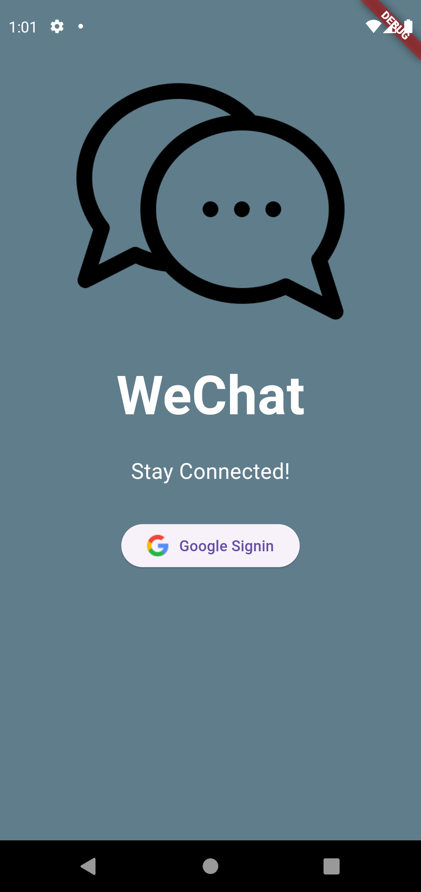
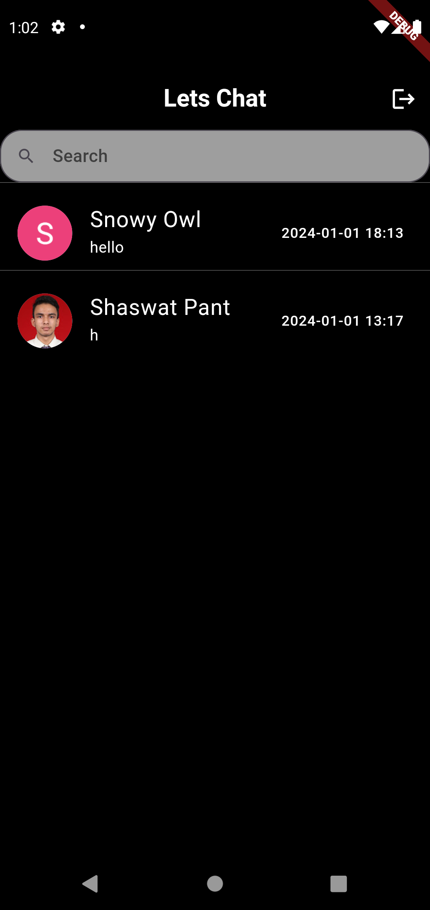
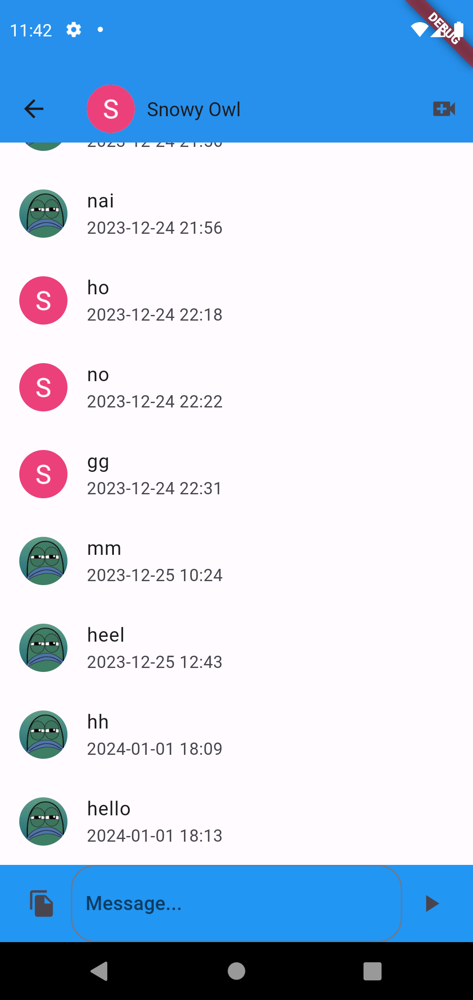
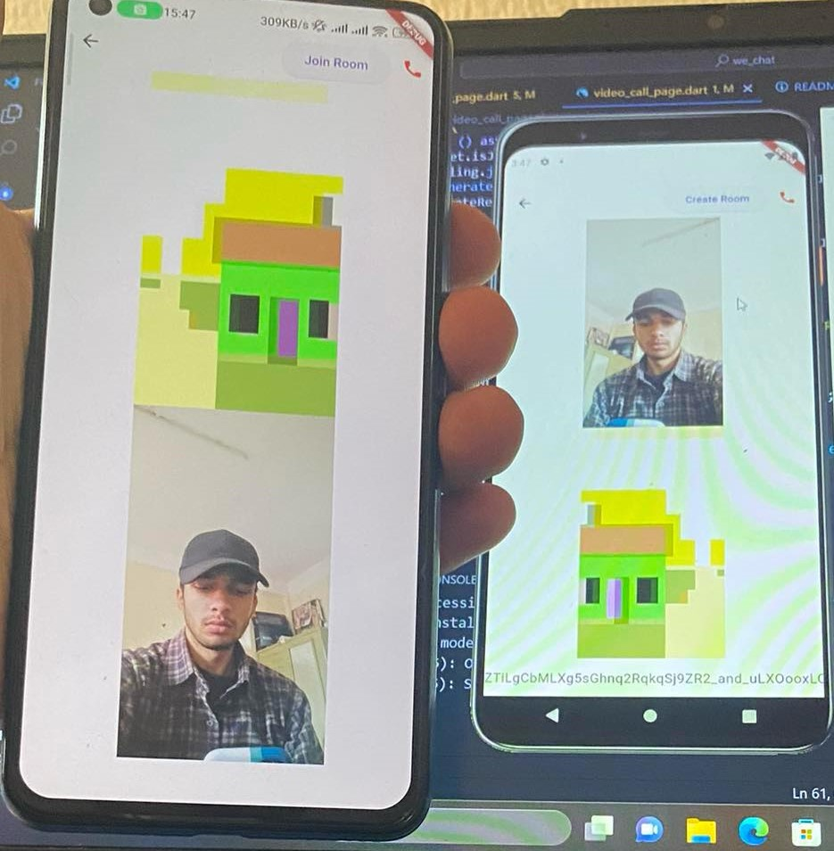

# WeChat

WeChat is a real-time chatting and video calling app (android/ios) made with flutter and firebase. The video calling was integrated using flutter_webrtc package and was based on https://www.youtube.com/watch?v=hAKQzNQmNe0&t=244s&ab_channel=FlutterExplained tutorial.

It uses google stun servers.

## Getting Started

```bash
flutter pub get
```

Connect it to your firebase app: https://firebase.google.com/docs/flutter/setup?platform=ios

## Snapshots




<div>


## Contributing

Pull requests are welcome. For major changes, please open an issue first to discuss what you would like to change.

Please make sure to update tests as appropriate.
